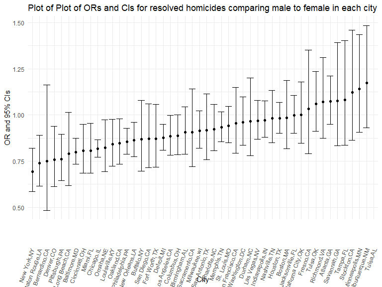
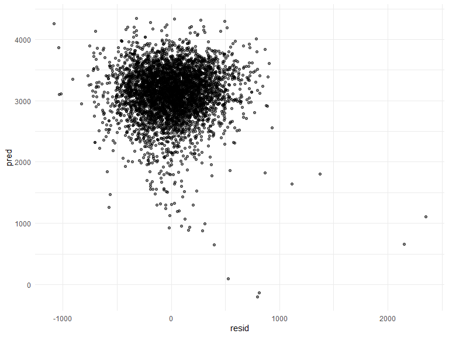
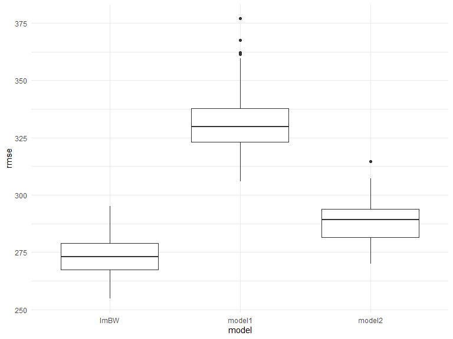

p8105_hw6_ll3407
================
2022-11-25

## Problem 2

Create a city_state variable and a binary variable indicating whether
the homicide is solved. Omit four cities. Limit to whites and blacks.

``` r
homicide = read_csv(file = "./data/homicide-data.csv") %>%
  janitor::clean_names() %>% 
  unite("city_state",c("city", "state"), sep = ",") %>% 
  mutate(
    resolved = recode(
       disposition, 'Closed by arrest' = 1, 'Closed without arrest' = 0, 'Open/No arrest' = 0)) %>% 
  filter(city_state != c("Dallas,TX", "Phoenix,AZ", "Kansas City,MO", "Tulsa,AL")) %>% 
  filter(victim_race == c("White","Black"))%>% 
  mutate(victim_age = as.numeric(victim_age))
```

    ## Rows: 52179 Columns: 12
    ## -- Column specification --------------------------------------------------------
    ## Delimiter: ","
    ## chr (9): uid, victim_last, victim_first, victim_race, victim_age, victim_sex...
    ## dbl (3): reported_date, lat, lon
    ## 
    ## i Use `spec()` to retrieve the full column specification for this data.
    ## i Specify the column types or set `show_col_types = FALSE` to quiet this message.

Fit a logistic regression model for Baltimore

``` r
Baltimore = homicide %>% 
  filter(city_state == "Baltimore,MD") 

  fit_Baltimore = glm(resolved ~ victim_age + victim_sex + victim_race, data = Baltimore)
```

OR and 95% CIs for the resolved homicide comparing male to female in
Baltimore

``` r
OR_Baltimore = fit_Baltimore %>% broom::tidy() %>%
  filter(term == "victim_sexMale") %>% 
  select(estimate, std.error) %>% 
  mutate(
    OR_M_to_F = exp(estimate),
    ci_lower = exp(estimate-1.96*std.error), 
    ci_upper = exp(estimate+1.96*std.error)
  )
```

GLM for each city. OR and 95% CI for resolved homicides comparing male
to female.

``` r
nest = homicide %>% 
  select(city_state,resolved,victim_age,victim_sex,victim_race) %>% 
  mutate(race = recode(
       victim_race, 'Black' = 1, 'White' = 0)) %>%   mutate(sex_male = recode(
       victim_sex, 'Male' = 1, 'Female' = 0, 'Unknown' = 0)) %>% 
   mutate(sex_unknown = recode(
       victim_sex, 'Unknown' = 1, 'Female' = 0, 'Male' = 0))  %>% 
  nest(df = -city_state) 

OR = nest %>% 
  mutate(
    models = map(.x = df, ~lm(resolved ~ victim_age + sex_male + sex_unknown + race , data = .x )),
    results = map(models, broom::tidy)
  ) %>% 
  select(city_state,results) %>% 
  unnest(results) 
  
  OR_all = OR%>%
  filter(term == "sex_male") %>% 
  select(city_state, estimate, std.error) %>% 
  mutate(
    OR_M_to_F = exp(estimate),
    ci_lower = exp(estimate-1.96*std.error), 
    ci_upper = exp(estimate+1.96*std.error)
  ) %>% 
    select( -estimate, -std.error) 
```

Plot of ORs and CIs for each city.

``` r
plot_OR = OR_all %>% ggplot(aes(reorder(city_state,OR_M_to_F), y = OR_M_to_F)) + geom_point() + 
    geom_errorbar(aes(ymin = ci_lower, ymax = ci_upper))+ 
  labs(
    title = "Plot of Plot of ORs and CIs for resolved homicides comparing male to female in each city",
    x = "City",
    y = "OR and 95% CIs") +
  theme(axis.text.x = element_text(angle = 70, vjust = 0.5, hjust = 1))

plot_OR
```


Comment: Telsa in AL has the highest OR of resolved homicides comparing
males to females, while New York in NY has the lowest. San Bernardino in
CA has the widest CI range of resolved homicides comparing males to
females, while Chicago in IL has the narrowest.

## Problem 3

Read and clean data

``` r
BW = read_csv(file = "./data/birthweight.csv") %>%
  janitor::clean_names() %>% 
  mutate(babysex = as.factor(babysex)) %>% 
  mutate(frace = as.factor(frace)) %>% 
  mutate(malform = as.factor(malform)) %>% 
  mutate(mrace = as.factor(mrace)) 
```

    ## Rows: 4342 Columns: 20
    ## -- Column specification --------------------------------------------------------
    ## Delimiter: ","
    ## dbl (20): babysex, bhead, blength, bwt, delwt, fincome, frace, gaweeks, malf...
    ## 
    ## i Use `spec()` to retrieve the full column specification for this data.
    ## i Specify the column types or set `show_col_types = FALSE` to quiet this message.

``` r
head(BW, 100)
```

    ## # A tibble: 100 x 20
    ##    babysex bhead blength   bwt delwt fincome frace gaweeks malform menarche
    ##    <fct>   <dbl>   <dbl> <dbl> <dbl>   <dbl> <fct>   <dbl> <fct>      <dbl>
    ##  1 2          34      51  3629   177      35 1        39.9 0             13
    ##  2 1          34      48  3062   156      65 2        25.9 0             14
    ##  3 2          36      50  3345   148      85 1        39.9 0             12
    ##  4 1          34      52  3062   157      55 1        40   0             14
    ##  5 2          34      52  3374   156       5 1        41.6 0             13
    ##  6 1          33      52  3374   129      55 1        40.7 0             12
    ##  7 2          33      46  2523   126      96 2        40.3 0             14
    ##  8 2          33      49  2778   140       5 1        37.4 0             12
    ##  9 1          36      52  3515   146      85 1        40.3 0             11
    ## 10 1          33      50  3459   169      75 2        40.7 0             12
    ## # ... with 90 more rows, and 10 more variables: mheight <dbl>, momage <dbl>,
    ## #   mrace <fct>, parity <dbl>, pnumlbw <dbl>, pnumsga <dbl>, ppbmi <dbl>,
    ## #   ppwt <dbl>, smoken <dbl>, wtgain <dbl>

Check missing data

``` r
  summary(BW$pnumlbw)
```

    ##    Min. 1st Qu.  Median    Mean 3rd Qu.    Max. 
    ##       0       0       0       0       0       0

``` r
  summary(BW$pnumsga)
```

    ##    Min. 1st Qu.  Median    Mean 3rd Qu.    Max. 
    ##       0       0       0       0       0       0

Variables of pnumlbw and pnumsga are with “0” value, so we should not
include them in the models

``` r
fit_BW = 
  BW %>% lm(bwt ~ babysex + bhead + blength + delwt + fincome + frace + gaweeks + malform + menarche + mheight + momage + mrace + parity + ppbmi + ppwt + smoken + wtgain, data = .) %>% broom::tidy()  
  
exclude = fit_BW %>% filter(p.value >= 0.05)
view(exclude)
```

In the logistic models, we will remove the covariate with a
p-value\>=0.05 (fincome, frace, malforml, menarche, mheight, momage,
ppbmi, ppwt).

``` r
lm_BW = lm(bwt ~ babysex + bhead + blength + delwt + gaweeks + mrace + parity + smoken + wtgain, data = BW)
```

Plot of predictions and residuals

``` r
Plot_pred_resid = BW %>% 
  add_predictions(lm_BW) %>% 
  add_residuals(lm_BW) %>% 
  ggplot(aes(x = resid, y = pred)) + 
  geom_point(alpha = .5)

Plot_pred_resid
```



Two other models

``` r
model_1 = lm(bwt ~ blength + gaweeks, data = BW) 

model_2 = lm(bwt ~ babysex + bhead + blength + babysex*bhead + babysex*blength + bhead*blength + babysex*bhead*blength, data = BW)
```

cross validation

``` r
cv_df = 
  crossv_mc(BW, 100) %>% 
  mutate(
    train = map(train, as_tibble),
    test = map(test, as_tibble)
  ) %>% 
  mutate(
    lm_BW_fits = map(.x = train, ~lm(bwt ~ babysex + bhead + blength + delwt + gaweeks + mrace + parity + smoken + wtgain, data = .x)),
    model1_fits = map(.x = train, ~lm(bwt ~ blength + gaweeks, data = .x)),
    model2_fits = map(.x = train, ~lm(bwt ~ babysex + bhead + blength + babysex*bhead + babysex*blength + bhead*blength + babysex*bhead*blength, data = .x))
  ) %>% 
  mutate(
    rmse_lmBW = map2_dbl(.x = lm_BW_fits, .y = test, ~rmse(model = .x, data = .y)),
    rmse_model1 = map2_dbl(.x = model1_fits, .y = test, ~rmse(model = .x, data = .y)),
    rmse_model2 = map2_dbl(.x = model2_fits, .y = test, ~rmse(model = .x, data = .y))
  )
```

Make a box plot

``` r
rmse_plot = cv_df %>% 
  select(starts_with("rmse")) %>% 
  pivot_longer(
    everything(),
    names_to = "model",
    values_to = "rmse",
    names_prefix = "rmse_"
  ) %>% 
  ggplot(aes(x = model, y = rmse)) +
  geom_boxplot()

rmse_plot
```



average rmse

``` r
cv_df %>% 
  select(starts_with("rmse")) %>% 
  pivot_longer(
    everything(),
    names_to = "model",
    values_to = "rmse",
    names_prefix = "rmse_"
  ) %>% 
  group_by(model) %>% 
  summarize(avg_rmse = mean(rmse))
```

    ## # A tibble: 3 x 2
    ##   model  avg_rmse
    ##   <chr>     <dbl>
    ## 1 lmBW       273.
    ## 2 model1     332.
    ## 3 model2     289.

The model I built is optimal, and model 2 is better than model 1.
